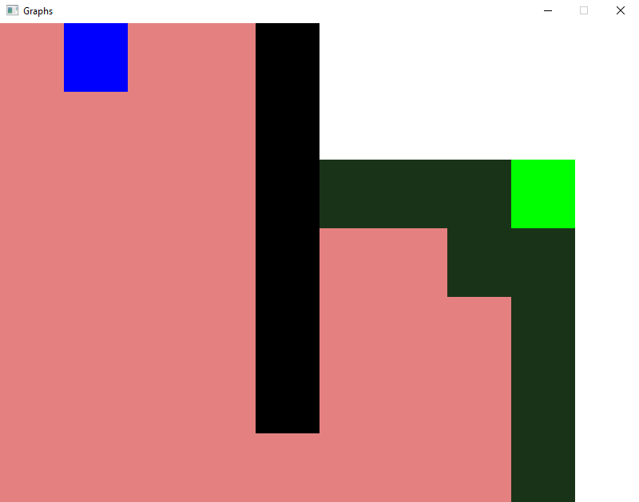
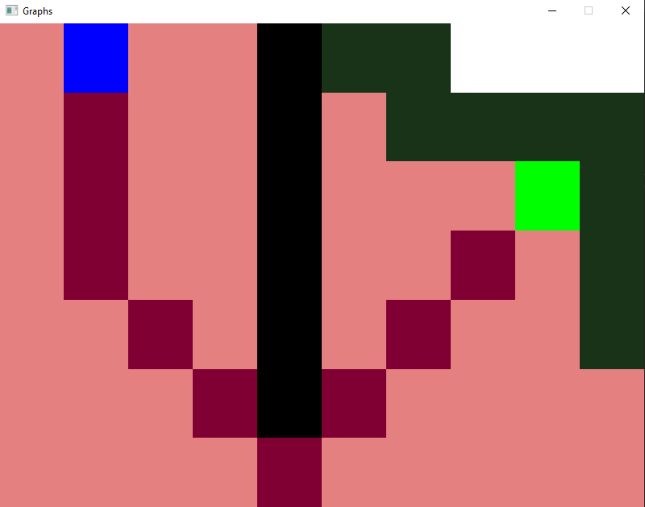

# Usage
1. Place walls using the left mouse button
2. Press right mouse button to change to start mode
3. Place the start position with left mouse button
4. Press right mouse button to change to end mode
5. Place end point with left mouse button
6. Press right mouse button to start the simulation
7. Press middle mouse button to restart

